# Implement a POC to migrate PHP-TODO app into a containerized application

Briefly, implementing a Proof of Concept POC to migrate a PHP-Todo app into a containerized application involves creating a small-scale version of the containerized setup to showcase how the PHP-Todo application can run smoothly within a container environment. This helps in validating the migration approach and ensuring that the application works as expected in the containerized environment before implementing the changes in a production setting.

**Install Docker and prepare for migration to the Cloud**

First, we need to install [Docker Engine](https://docs.docker.com/engine/), which is a client-server application that contains:

Before we proceed further, let us understand why we even need to move from VM to Docker.

- As you have already learned – unlike a VM, Docker does not allocates the whole guest OS for your application, but only isolated minimal part of it – this isolated container has all that your application needs and at the same time is lighter, faster, and can be shipped as a `Docker image` to multiple physical or virtual environments, as long as this environment can run Docker engine.

- This approach also solves the environment incompatibility issue. It is a well-known problem when a developer sends his application to you, you try to deploy it, deployment fails, and the developer replies, "- It works on my machine!". With Docker – if the application is shipped as a container, it has its own environment isolated from the rest of the world, and it will always work the same way on any server that has Docker engine.

As part of this project, we will use Jenkins for Continous Integration (CI).

To begin our migration project from VM based workload, we need to implement a `Proof of Concept (POC)`. In many cases, it is good to start with a small-scale project with minimal functionality to prove that technology can fulfill specific requirements. So, this project will be a precursor before we can move on to deploy enterprise-grade microservice solutions with Docker.

You can start with your own workstation or spin up an EC2 instance to install Docker engine that will host your Docker containers.

The `Todo website code base` we are working with is a PHP-based solution backed by a MySQL database.

# PART 1

We will start by assembling our application from the Database layer

### MySQL in container

We will use a pre-built MySQL database container, configure it, and make sure it is ready to receive requests from our PHP application.

**Step 1: Pull MySQL Docker Image from** [Docker Hub Registry](https://hub.docker.com/)

Start by pulling the appropriate [Docker image for MySQL](https://hub.docker.com/_/mysql). You can download a specific version or opt for the latest release, i am using the *latest* tag here.

`docker pull mysql/mysql-server:latest`

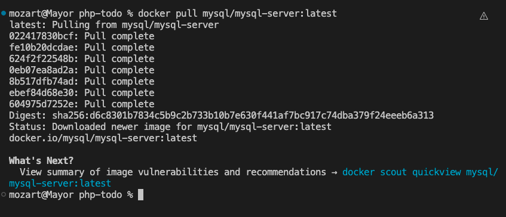

List the images to check that you have downloaded them successfully:

`docker image ls`


Let's create a network:

`docker network create --subnet=172.18.0.0/24 my_todo_network`

`docker network ls`


Creating a custom network is not necessary because even if we do not create a network, Docker will use the default network for all the containers you run. By default, the network we created above is of DRIVER Bridge. So, also, it is the default network.

But there are use cases where creating a subnet is neccessary. For example, if there is a requirement to control the cidr range of the containers running the entire application stack. This will be an ideal situation to create a network and specify the --subnet
For clarity’s sake, we will create a network with a subnet dedicated for our project and use it for both MySQL and the application so that they can connect.


- Run the MySQL Server container using the created network.

`docker run --network my_todo_network -h mysqlserverhost --name mysql-todo -d mysql/mysql-server:latest`

`docker ps`

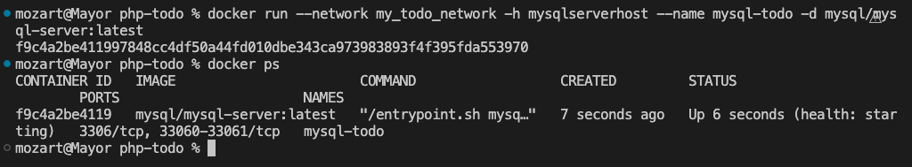

Flags used

- -d runs the container in detached mode
- --network connects a container to a network
- -h specifies a hostname
- --name gives a custom name to the container

Once initialization is finished, the command's output is going to contain the random password generated for the root user; check the password with this command:

`docker logs mysql-todo 2>&1 | grep GENERATED`

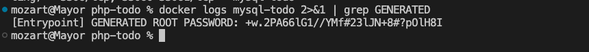

## Connecting to MySQL Server from within the Container

Run the `mysql client` within the `MySQL Server` container you just started and connect it to the MySQL Server. Use the `docker exec -it` command to start a mysql client inside the Docker container you have started, like this

`docker exec -it mysql-todo mysql -uroot -p`

When asked, enter the generated root password. Because the MYSQL_ONETIME_PASSWORD option is true by default, after you have connected a mysql client to the server, you must reset the server root password by issuing this statement:

`mysql> ALTER USER 'root'@'localhost' IDENTIFIED BY 'password';`

Let's go ahead to create the User and Database

`mysql> CREATE USER 'mayor'@'172.18.0.3' IDENTIFIED BY 'Ashabi_123'; GRANT ALL PRIVILEGES ON *.* TO 'mayor'@'172.18.0.3';`

`mysql> CREATE DATABASE tododb;`

`exit`


Step 2:

1. Clone the PHP-Todo-app repository from [here](https://github.com/darey-devops/php-todo.git)

2. Update the .env file with connection details to the database

```
sudo vi .env


DB_HOST=mysqlserverhost
DB_DATABASE=tododb
DB_USERNAME=mayor
DB_PASSWORD=Ashabi_123
DB_CONNECTION=mysql
DB_PORT=3306  
```

- DB_HOST mysql ip address “leave as **mysqlserverhost**”
- DB_DATABASE mysql databse name
- DB_USERNAME mysql username for user export as environment variable
- DB_PASSWORD mysql password for the user exported as environment varaible
- DB_CONNECTION mysql connection "leave as **mysql**"
- DB_PORT mysql port "leave as **3306**"

3. Run the Todo App

Containerization of an application starts with creation of a file with a special name `Dockerfile` (without any extensions). This can be considered as a *recipe* or *instruction* that tells Docker how to pack your application into a container. 

Refer to the `Dockerfile` in this repo

So, let us containerize our Todo application; here is the plan:

- Make sure you have checked out this Todo repo to your machine with Docker engine.

- First, we need to build the Docker image the Todo app will use. The Todo repo you cloned above has a Dockerfile i built for this purpose.

- Run `docker build` command
 
- Launch the container with docker run

- Try to access your application via port exposed from a container

Let us begin:

Ensure you are inside the directory `php-todo` that has the file Dockerfile and build your container :

` docker build -t todo-app-image:1.0.0 .`

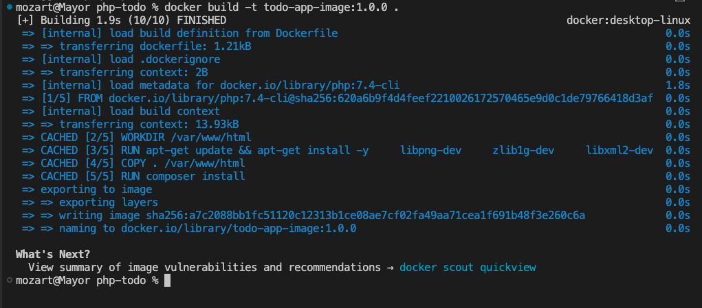

In the above command, we specify a parameter `-t`, so that the image can be tagged todo-app-image:1.0.0 - Also, you have to notice the `.` at the end. This is important as that tells Docker to locate the Dockerfile in the current directory you are running the command. Otherwise, you would need to specify the absolute path to the Dockerfile.

4. Run the container:

`docker run --network my_todo_network --name todo-app-coantainer -p8000:8000 -d todo-app-image:1.0.0`

`docker ps`

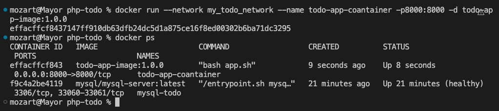

Let us observe those flags in the command;

We need to specify the `--network` flag so that both the *Todo app* and the *Database* can easily connect on the same virtual network we created earlier.
The `-p` flag is used to map the container port with the host port. Within the container, Laravel is the webserver running and, by default, it listens on port 8000. We used port 8000 directly on our host because it is bot in use yet. If it was in use, the workaround is to use another port that is not used by the host machine, so we can then map that to port 8000 running in the container (could somethong like -p8085:8000).

- Access the web on your browser

http://localhost:8000

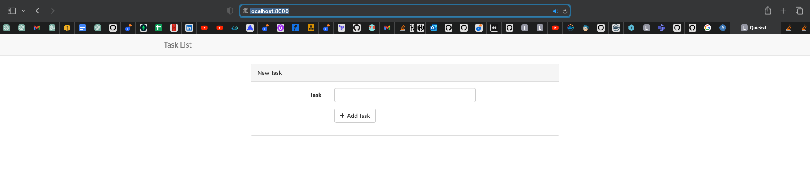

# PART 2

### PUSH DOCKER IMAGE TO CONTAINER REPOSITORY

Lets go ahead to push our Docker image from the local machine to a container registry (repository). In this case Docker Hub.

1. Please make sure you have a [Docker Hub account](https://hub.docker.com/signup/awsedge) before you proceed.

2. Create a new Docker Hub repository

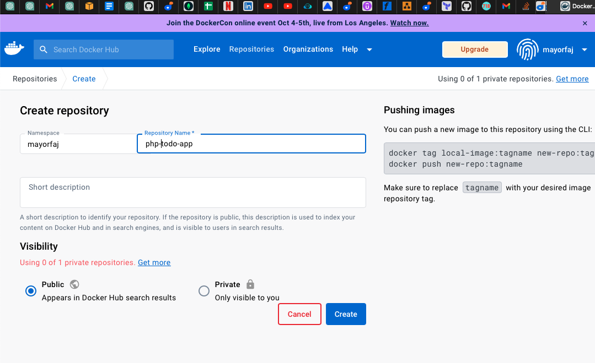

3. Push the docker images from your PC to the repository

- **Log in to Docker Hub:**

Use the docker login command to log in to your Docker Hub account on your console.
You will be prompted to enter your Docker Hub username and password.

`docker login`

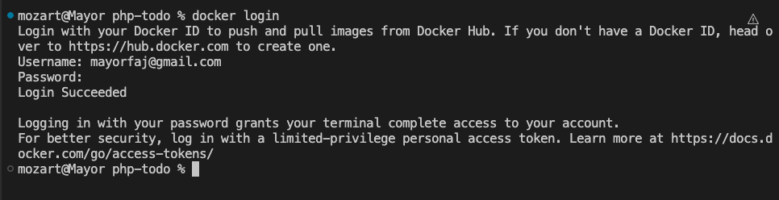

- **Tag your Docker Image:**

`docker tag local-image:tagname DockerHubusername/repositoryname:tagname`

`docker tag todo-app-image:1.0.0 mayorfaj/php-todo-app:1.0`

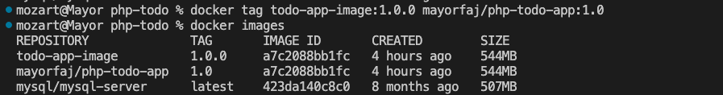

- **Push the Docker Image:**

`docker push username/repositoryname:tagname`

`docker push mayorfaj/php-todo-app:1.0`

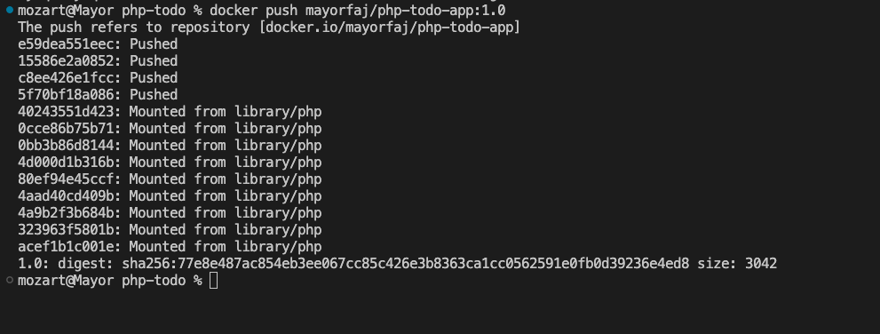

Check your Docker account to confirm it has been pushed suuccessfully

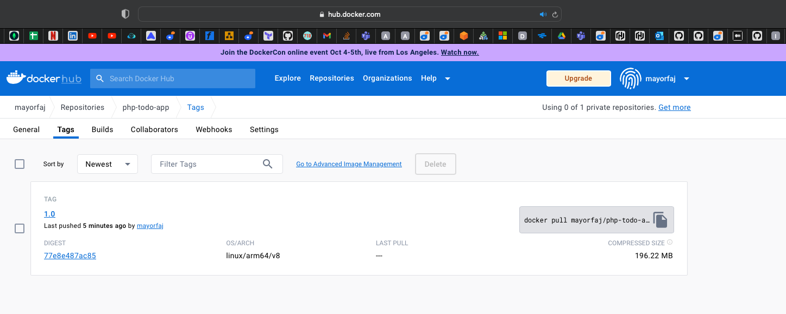

# PART 3

### Step 1

We write a Jenkinsfile that will simulate a Docker Build and a Docker Push to the registry `Refer to the Jenkinsfile for this`

### Step 2
Connect your repo to Jenkins

To start with we will push our code to github repository

`git checkout feature-001`

`git add .`

`git commit -m "Jenkins-file updated"`

`git push --set-upstream origin feature-001`

Make sure to enable webhooks in your GitHub repository settings

**We'll be using Ubuntu 20.04 for Jenkins server. Refer to this repository [Terraform for Jenkins and Promethueus]() where you will find the Infrastucture as Code written to setup Jenkins server.
NB: I have bootstraped jenkins and docker configuration in the lunch template.**

Access jenkins url from the browser.

`<public-ip>:8080`

Install Blue ocean plugin; a user interface (UI) extension for Jenkins. It provides a modern, visually appealing, and more intuitive user interface for Jenkins users

Then go ahead and Open blue ocean plugin in Jenkins and create a new pipeline. It will ask for a token, generate a token in your github and paste. Then connect this repo that contains your php-todo code app(which includes the jenkins file).
Click on Administration to exit the Blue Ocean console.

Here is our newly created pipeline. It takes the name of your GitHub repository.


Click on the repo and Click on configure

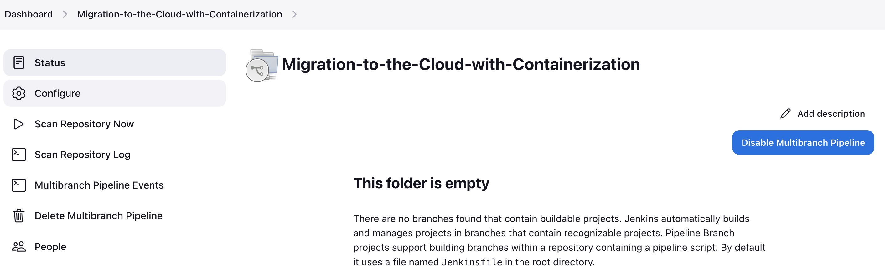


### Step 3

Create a multi-branch pipeline

### Step 4

Simulate a CI pipeline from a feature and master branch using previously created Jenkinsfile


### Step 5

Ensure that the tagged images from your Jenkinsfile have a prefix that suggests which branch the image was pushed from. For example, feature-001

### Step 6

Verify that the images pushed from the CI can be found in the registry.


# Part 2

**Docker Compose**

docker-compose -f todo.yml up .

Docker Volumes loccations

LINUX AND MAC
/var/lib/docker/volumes

Fpr Mac specifically , run this first
screen /Library/Containers/com.docker.docker/Data/com.docker.driver.amd64-linux/tty


Jenkins file

Using CredentiaLS IN JENKINS GUI

2. "credentials("credentialsID")"binds credentials to your new env variable

3. For that we need "credentials" and "Credentials Binding" Plugin